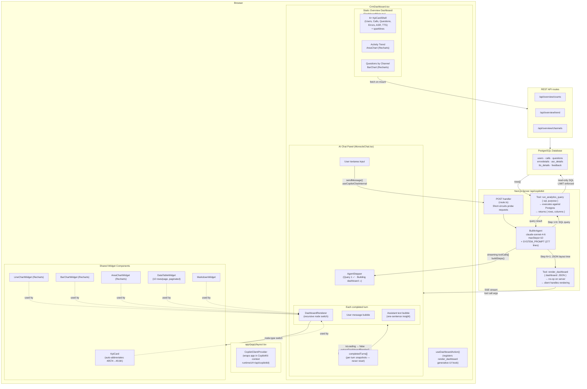

# Monocle — Architecture & Data Flow

## Short answer

**Yes — every widget that appears inside the chat (KPI cards, charts, tables, markdown) is 100% generated by the AI agent at runtime.** The agent writes SQL, executes it against the real database, then produces a JSON layout tree that the client validates and renders into React components. Nothing in the chat is hardcoded.

The main Overview dashboard (left content area) is a completely separate, hardcoded component that fetches data from REST APIs independently.

---

## Block diagram



---

## Flow step by step

### 1 — User sends a message
`MonocleChat` calls `sendMessage()` via `useCopilotChatInternal`. This opens a Server-Sent Events stream to `/api/copilotkit`.

### 2 — Server: agentic loop
`BuiltInAgent` (Claude Sonnet, `maxSteps=10`) receives the message and the 277-line `SYSTEM_PROMPT`. The prompt tells the agent to:
1. Call `run_analytics_query` with a `SELECT` statement
2. Call `render_dashboard` with a JSON layout tree
3. Write one sentence summary

### 3 — SQL execution
`run_analytics_query.execute()` runs the SQL via `lib/data/query.ts` (postgres.js). Safety guards: read-only check, blocked schemas (`auth`, `pg_*`, `information_schema`), auto `LIMIT 5000` cap. Results stream back to the agent as `{ rows, columns }`.

### 4 — Dashboard JSON generation
The agent calls `render_dashboard` with a full JSON tree, e.g.:
```json
{
  "title": "Voice Questions Log",
  "layout": {
    "type": "col",
    "children": [
      { "type": "kpi", "label": "Total Voice Questions", "value": "21K" },
      {
        "type": "table",
        "title": "Recent Questions",
        "columns": ["questiontext", "created_at"],
        "rows": [...],
        "pageSize": 10
      }
    ]
  }
}
```
The server's `execute()` is a no-op — it just returns `"Dashboard rendered on client."`.

### 5 — Client: parsing
`MonocleChat` watches `messages[]` via `useCopilotChatInternal`. `extractDashboardRender()` scans for a `render_dashboard` tool call in the message list, parses its `arguments` JSON, and validates it with `DashboardSchema.safeParse()` (Zod). The schema is lenient — it normalises AI deviations like `title` instead of `label` on KPI nodes, or `{ type: "chart", chartType: "line" }` instead of `{ type: "line" }`.

### 6 — Turn snapshot
When `isLoading` transitions `true → false`, a `useEffect` snapshots the completed turn into `completedTurns[]`. Snapshots persist forever — multi-turn conversations keep all previous dashboards visible.

### 7 — Rendering
`DashboardRenderer` recursively walks the `LayoutNode` tree, mapping each `node.type` to a widget component:

| `node.type` | Component | Notes |
|---|---|---|
| `"grid"` / `"row"` / `"col"` | CSS layout div | Recursive container |
| `"kpi"` | `KpiCard` | Auto-abbreviates numbers ≥ 1K |
| `"table"` | `DataTableWidget` | 10 rows/page, paginated |
| `"bar"` | `BarChartWidget` | Recharts BarChart |
| `"line"` | `LineChartWidget` | Recharts LineChart |
| `"area"` | `AreaChartWidget` | Recharts AreaChart |
| `"markdown"` | `MarkdownWidget` | Inline bold/code rendering |

---

## Two dashboards — completely separate

| | Static Overview (`DashboardMain`) | AI Chat (`MonocleChat`) |
|---|---|---|
| **Structure** | Hardcoded React components | Agent-generated JSON tree |
| **Data** | `/api/overview/*` REST endpoints | Agent SQL via `run_analytics_query` |
| **Widgets** | `KpiCardShell` (custom, with sparklines) | `KpiCard`, chart widgets, `DataTableWidget` |
| **Pagination** | N/A (aggregated data) | `DataTableWidget` — 10 rows/page |
| **Updates** | On page load / date range change | On each user question |

---

## Key files

| File | Role |
|---|---|
| `app/api/copilotkit/route.ts` | Agent server, tool definitions, SSE handler |
| `lib/prompts/system.ts` | Agent brain — instructions, DB schema, layout rules |
| `lib/data/query.ts` | Safe SQL executor (read-only guard, LIMIT cap) |
| `lib/schemas/dashboard.ts` | Zod schema — validates & normalises agent JSON output |
| `components/copilot/MonocleChat.tsx` | Chat UI, turn snapshots, live stepper |
| `components/DashboardRenderer.tsx` | Recursive node-type → component mapper |
| `components/widgets/KpiCard.tsx` | KPI card with number abbreviation |
| `components/widgets/DataTableWidget.tsx` | Paginated table (10 rows/page) |
| `components/dashboard/DashboardMain.tsx` | Static hardcoded overview dashboard |
| `components/dashboard/CrmDashboard.tsx` | App shell — sidebar, header, chat panel, fullscreen |
